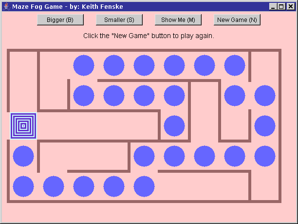

### Maze Fog Game (Java)

by: Keith Fenske, https://kwfenske.github.io/

MazeFog is an old Java 1.1 AWT (GUI) applet to play a maze game. The computer
creates a random maze. The exit is marked by blue and white boxes. Your
position is marked by a blue circle. Use the arrow keys or the mouse to move
towards the exit. You may have to reposition your mouse if you bump into walls!
There are no monsters or obstacles in the maze. Your view is limited by a "fog"
that shows only nearby positions and positions that you have already visited.

The program's comments and documentation reference web sites that no longer
exist, and discuss differences in Java versions that are now meaningless. No
changes will be considered. Web page applets are obsolete and may run as
stand-alone applications with the help of a wrapper (included). This becomes
less likely after Java 9 (2017). Rewriting for Java Swing or newer JavaFX is
not an easy job.

Download the ZIP file here: https://kwfenske.github.io/maze-fog-game-java.zip

Released under the terms and conditions of the GNU General Public License,
version 3 or later (GPLv3+). Permission is hereby granted to convert this web
page applet to the Apache License (version 2.0 or later) or to GNU GPLv2.

